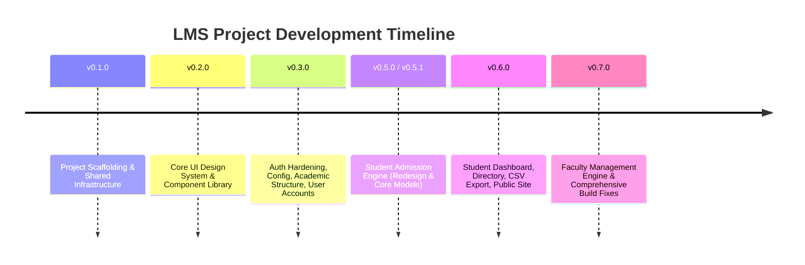

# LMS Project - Completed Work Summary

This document provides a detailed overview of the modules, architectures, and features implemented in the **Learning Management System (LMS)** project.

---

## 🛠️ Project Architecture Overview

The system is built as a monorepo containing a modern stack separated into:
* **Frontend**: Built using React 19, TypeScript, Vite, Tailwind CSS v4, Zustand (state management), TanStack Query (data fetching), and Framer Motion (animations).
* **Backend**: Built using Node.js, Express, TypeScript, Zod (validation), Winston (logging), and Prisma ORM connected to a relational database.

---

## 📅 Roadmap & Version History

### 1. Milestone v0.1.0 — Foundation & Infrastructure
* **Frontend Setup**:
  * Configured React 19, TypeScript 6, and Vite with absolute path aliases (`@/*` mapping to `src/*`).
  * Configured Tailwind CSS v4 styling rules and custom CSS variables.
  * Added core clients and templates (Zustand state store, TanStack Query, Axios).
  * Designed mock login and dashboard pages with micro-animations.
* **Backend Setup**:
  * Scaffolded Express application with security utilities (Helmet, CORS).
  * Configured Winston logger and Morgan stream middleware for clean execution logging.
  * Added Zod environment variable validation at runtime.
  * Configured Prisma Client singleton manager with logging hooks.
  * Implemented global error handling middleware with custom `AppError` mappings.
* **Repository Assets**:
  * Created [.gitignore](file:///e:/LMS/.gitignore), [.editorconfig](file:///e:/LMS/.editorconfig), [PROJECT_RULES.md](file:///e:/LMS/PROJECT_RULES.md), and [CONTRIBUTING.md](file:///e:/LMS/CONTRIBUTING.md).

### 2. Milestone v0.2.0 — Core UI & Theme Engine
* **Theme System**:
  * Configured dynamic ThemeProvider (supporting Light, Dark, and System modes) using Tailwind-compatible variables.
  * Curated standard HSL palettes for primary, secondary, warning, error, success, info, and neutral color spaces.
* **Component Library**:
  * Built 18 customized, clean-typed React primitives (Button, Input, Select, Table, Modal, Drawer, Toast, Breadcrumbs, Tabs, etc.) with Framer Motion transitions.
* **Navigation & Simulation**:
  * Role-based responsive navigation sidebars, headers, and mobile drawers.
  * Built-in developer role simulator widget in the header to switch perspectives (Admin, Teacher, Student).
  * SVG-animated dashboard widgets for statistics and charts.

### 3. Milestone v0.3.0 — Core Authentication & System Configuration
* **Authentication Hardening**:
  * Enforced strong JWT secrets (min 32 characters) in configuration.
  * Implemented a secure password reset flow (token database storage & mock email sending).
  * Added a dedicated session expiration page handling token refresh queue failures.
* **System Config Engine**:
  * School Profile CRUD with branding assets upload via Cloudinary.
  * Academic Calendar structure: `AcademicYear` and `AcademicTerm` data models.
  * Grading Scale mapping and general configuration settings.
* **Academic Engine**:
  * Established academic structures: `AcademicYear` ➔ `Class` ➔ `Section` ➔ `Subject` ➔ `ClassSubject` ➔ `ExamType`.
  * Designed aggregate endpoints for fetching structures (`GET /academic-structure/structure`) to optimize load performance.
  * Built database constraints to block deletion of entities referenced downstream.
* **Users & Roles**:
  * CRUD for login account user records.
  * Role and permission system with database seeds, permission mappings, and `useEffectiveRole` hook carrying a Super Admin wildcard (`*`) override.

### 4. Milestones v0.5.0 & v0.5.1 — Student Admission Engine (Database Schema & Business Logic)
* **Schema Redesign**:
  * Designed the dynamic `Enrollment` model linking a student to an academic year, class, section, and roll number. This preserves historical academic data across years.
  * Split `fullName` into `firstName`, `middleName`, and `lastName` fields.
  * Added structured permanent and temporary address models.
* **Admissions Workflow (`POST /students/admission`)**:
  * Processes student metadata, multiple guardian entries (Father/Mother/Guardian relations), and file documents atomically within a database transaction.
  * Automatic generation of custom student admission numbers (e.g. `DPS-2025-0001`) dynamically using school profile short-code and admission year.
  * Integrated Cloudinary uploading pipeline for scanned certificate PDF attachments and profile images.

### 5. Milestone v0.6.0 — Student Frontend & Public Website
* **Student Directory & Management UI**:
  * **Student Dashboard**: Stat widgets for registration counts and chronological list of recent enrollments.
  * **Students Registry**: Paginated student table with filtering (year, class, section, status) and advanced search (by name, admission number, or guardian name/phone number).
  * **CSV Exporter**: Custom helper utilities supporting CSV generation directly inside the client.
  * **Student Detail Pages**: Detailed updates for student profiles, document uploads, guardian listings, and enrollment history.
* **Promotions Workflow**:
  * Implemented promotion logic (`POST /students/:id/promote`) creating new `Enrollment` records for subsequent years while validating placements.
* **Audit Logging System**:
  * Integrated an automated log trail mapping actions like `STUDENT_ADMITTED`, `STUDENT_PROMOTED`, `STUDENT_UPDATED`, and `STUDENT_STATUS_CHANGED` into the database audit log.
* **Public School Marketing Website**:
  * Built landing pages containing stats, hero sliders, FAQs, dynamic curriculum directories, notice boards, principal letters, and tuition fees schedules.

### 6. Milestone v0.7.0 — Faculty Management Engine
* **Faculty Engine Backend**:
  * Added reference lookup configurations for **Departments** and **Designations**.
  * **Teacher Registration Workflow (`POST /faculty/teachers`)**: Atomically creates employee numbers (e.g., `DPS-EMP-0001` via a persistent global sequence counter), registers qualifications, contact detail matrices, and files.
  * **Teacher Lifecycles**: Flexible status options (`ACTIVE | ON_LEAVE | SUSPENDED | RESIGNED | TERMINATED | RETIRED`) allowing terminal value reversion.
  * **Leave Balances**: Tracks used and total allocated leave categories.
  * **Cross-Engine Binding**: Enabled assigning teacher profiles to class subjects inside the academic structure engine.
* **Faculty Engine Frontend**:
  * Built teacher profiles management, search indexes, department admin configurations, and detail views mapped to appropriate permission levels.
* **Build & Bug Fixes**:
  * Solved typescript errors in React Hook Form types mapping from Zod coerced outputs.
  * Standardized audit logging action triggers across reference data modifications.

---

## 🗄️ Summary Database Schema Models

The current Prisma database schema supports the following models:

| Engine | Models / Tables |
| :--- | :--- |
| **Auth & Users** | `User`, `Role`, `Permission`, `RolePermission`, `UserRole`, `AuditLog`, `PasswordResetToken` |
| **System Config** | `SchoolProfile`, `SchoolLeadership`, `AcademicYear`, `AcademicTerm`, `GradingScale`, `SystemSetting` |
| **Academic Structure** | `Class`, `Section`, `Subject`, `ClassSubject`, `ExamType` |
| **Student Engine** | `Student`, `Enrollment`, `StudentGuardian`, `StudentDocument` |
| **Faculty Engine** | `Department`, `Designation`, `Teacher`, `TeacherQualification`, `TeacherEmergencyContact`, `TeacherDocument`, `TeacherLeaveBalance`, `EmployeeNumberSequence` |

---

## 📂 Core Project Files

* **Changelog**: Detailed release logs are maintained in [CHANGELOG.md](file:///e:/LMS/CHANGELOG.md).
* **Project Constitution**: Guidelines, coding styles, and rules are found in [PROJECT_RULES.md](file:///e:/LMS/PROJECT_RULES.md).
* **Prisma Schema**: The database model blueprint is defined in `backend/prisma/schema.prisma`.
