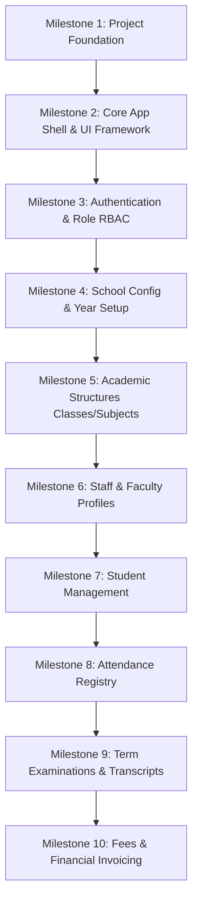

# Deukhuri Digital Campus ERP

A production-ready, commercial-grade School Enterprise Resource Planning (ERP) platform custom-built for **Deukhuri Digital Campus** (Nepal). This monorepo project follows a strict decoupled modular architecture featuring a React SPA client and an Express REST API backend.

---

## 🏛️ Project Architecture & Layout

This project is structured as a clean monorepo:
- **`frontend/`**: Single Page Application built with **React 19**, **TypeScript 6**, **Vite 8**, and styled with **Tailwind CSS v4** themes.
- **`backend/`**: RESTful API server powered by **Node.js**, **Express**, and **Prisma ORM** connecting to a PostgreSQL database.
- **`docs/`**: Architectural Decision Records (ADRs) and planning specifications.

For structural coding guidelines and conventions, refer to the [Project Rules Constitution](file:///e:/LMS/PROJECT_RULES.md).

---

## 🗺️ Milestone Roadmap

We structure the development pipeline based on logical database dependencies. Academic structures, school setups, and years are established *before* student or attendance modules to ensure structural integrity and prevent database duplication.



### Milestone Descriptions

| Milestone | Stage | Description | Status |
| :--- | :--- | :--- | :--- |
| **Milestone 1** | **Project Foundation** | Decoupled subprojects initialization, paths mapping, Helmet/CORS guards, Winston logger, and global error middleware. | ✅ **Complete** |
| **Milestone 2** | **Core App Shell** | Centralized design tokens (HSL variables), collapsible Sidebar, breadcrumbs locator, theme Provider, custom UI primitives, and animated widgets. | ✅ **Complete** |
| **Milestone 3** | **Authentication** | Login portals, secure JWT session management, Role-Based Access Control (RBAC), and route protection guards. | 🚧 *Planned* |
| **Milestone 4** | **School Configuration** | Institutional meta profiles (address, logos), active Academic Years, and primary calendar rules. | 📋 *Planned* |
| **Milestone 5** | **Academic Structure** | Configuration boards for Classes, Sections, Course syllabi, and Subject catalogues. | 📋 *Planned* |
| **Milestone 6** | **Faculty Management** | Teacher designations, schedules, leave application routing, and departments. | 📋 *Planned* |
| **Milestone 7** | **Student Management** | Admissions ledger, directory files, rank charts, and profiles. | 📋 *Planned* |
| **Milestone 8** | **Attendance Registry** | Daily assembly registry, class trackers, and automated absence reports. | 📋 *Planned* |
| **Milestone 9** | **Exams & Grading** | Examination rosters, marking ledgers, term GPA grids, and certificate PDF generation. | 📋 *Planned* |
| **Milestone 10** | **Billing & CMS** | Student fee invoicing, invoice clearance, notice announcements, and public campus landing page content. | 📋 *Planned* |

---

## 🛠️ Developer Setup & Operations

### Requirements
- Node.js (v18+)
- npm (v10+)
- PostgreSQL (for backend database integration)

### Running the Application

1. **Clone and Install Dependencies**:
   ```bash
   # Install root level dependencies
   npm install
   
   # Setup frontend
   cd frontend
   npm install
   
   # Setup backend
   cd ../backend
   npm install
   ```

2. **Run Dev Servers**:
   Launch both workspace runners concurrently.
   
   - **Frontend Runner**:
     ```bash
     cd frontend
     npm run dev
     ```
     Access local portal at `http://localhost:5173`.
     
   - **Backend Runner**:
     ```bash
     cd backend
     npm run dev
     ```
     Server listens on default port specified in your `.env`.

3. **Code Compliance & Quality Checks**:
   Always run quality checks before submitting pull requests:
   ```bash
   # Run code formatting checks
   npm run lint
   
   # Verify typescript compiles correctly
   npm run build
   ```

---

## ⭐ Commercial Quality Guidelines
To transition Deukhuri Digital Campus from a customized project to a reusable SaaS product, we enforce:
1. **Zero Technical Debt**: Document all compromises in architectural logs.
2. **Dynamic Specs**: Every feature from Sprint 2 onward is designed with a mini-specification (pages, DB schema, logic, DOD) prior to coding.
3. **Deployable Main Branch**: `develop` and `main` branches must remain fully compilable and deployable at all times.
