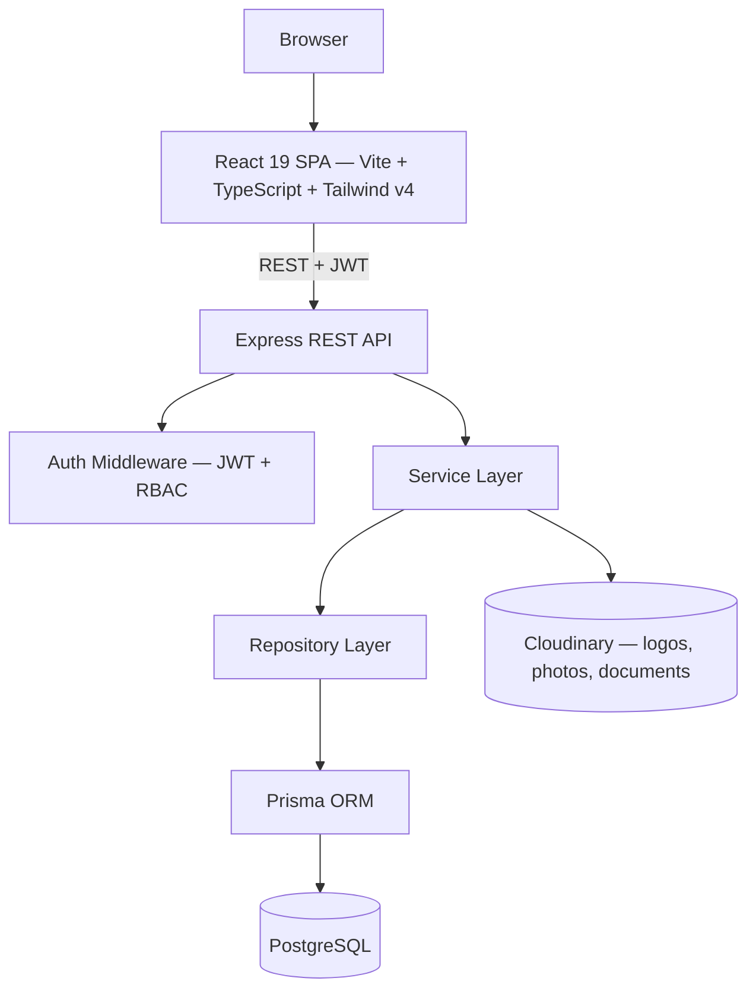
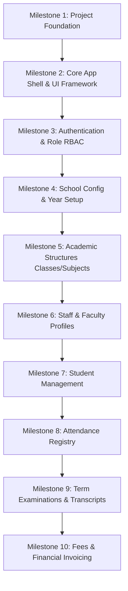

# Deukhuri Digital Campus

**Enterprise Resource Planning Platform for Deukhuri Public School**

A production-ready, commercial-grade School ERP platform. **Deukhuri Digital Campus** is the product; **Deukhuri Public School** (Lamahi, Dang, Nepal) is its first deployment — the platform is built engine-by-engine so it can eventually serve more than one school. This monorepo follows a strict decoupled modular architecture: a React SPA client and an Express REST API backend, talking over a versioned REST contract.

---

## 🧭 System Architecture


```mermaid
graph TD
    Browser[Browser] --> SPA[React 19 SPA — Vite + TypeScript + Tailwind v4]
    SPA -->|REST + JWT| API[Express REST API]
    API --> Auth[Auth Middleware — JWT + RBAC]
    API --> Services[Service Layer]
    Services --> Repos[Repository Layer]
    Repos --> Prisma[Prisma ORM]
    Prisma --> DB[(PostgreSQL)]
    Services --> Cloudinary[(Cloudinary — logos, photos, documents)]
```

Every backend module follows the same **Controller → Service → Repository** chain — controllers never touch Prisma directly (see [Engineering Principles](#-engineering-principles)). The frontend mirrors this with a **feature-folder** structure: each engine owns its own pages, components, hooks, and services under `frontend/src/features/<engine>/`.

---

## 📁 Repository Structure

```
LMS/
├── frontend/                  # React 19 + TypeScript + Vite + Tailwind v4 SPA
│   └── src/
│       ├── features/          # One folder per engine (auth, students, public-site, ...)
│       ├── pages/              # Standalone/shared pages not yet split into a feature
│       ├── layouts/            # DashboardLayout, AuthLayout, PublicLayout
│       ├── components/ui/      # Shared design-system primitives
│       └── routes/             # Centralized React Router route tree
├── backend/                   # Express + Prisma REST API
│   └── src/
│       ├── modules/            # One folder per engine (controller/service/repository/routes)
│       ├── prisma/              # schema.prisma, migrations, seed.ts
│       ├── middleware/          # auth, error handling, upload, validation
│       └── utils/                # audit-log, api-response, logger
├── docs/
│   ├── architecture/            # ADRs (Architectural Decision Records)
│   └── api/                     # Per-engine API reference docs
├── .github/                    # Issue templates, PR template
├── PROJECT_RULES.md            # Project constitution / coding conventions
├── CONTRIBUTING.md
├── CHANGELOG.md
└── README.md
```

For structural coding guidelines and conventions, refer to the [Project Rules Constitution](file:///e:/LMS/PROJECT_RULES.md).

---

## ⚙️ Engineering Principles

1. **Repository Pattern** — all database access goes through a repository class; services never import `prisma` directly, and controllers never import a repository directly.
2. **Service Layer** — business rules (validation, cross-engine composition, transactions) live in services, not controllers or repositories.
3. **No Direct Prisma in Controllers** — enforced by convention and code review; a controller's only job is parsing the request and shaping the response.
4. **Engine / Feature-Based Architecture** — each domain (auth, students, academic-structure, public-site, ...) is a self-contained vertical slice on both backend (`modules/<engine>/`) and frontend (`features/<engine>/`), designed to be reusable and independently extensible.
5. **Cross-Engine Composition, Not Duplication** — when one engine needs another's data (e.g. Student Admission validating a Class/Section from the Academic Engine), it composes that engine's repository rather than re-querying the table or trusting a bare foreign key.
6. **Archive, Don't Delete** — reference data uses soft `ACTIVE | ARCHIVED` status; hard-delete is only reachable when zero records still reference a row.
7. **Audit Everything That Mutates State** — a shared `audit-log` utility records who did what, reusable by any engine, backed by one `AuditLog` table.
8. **Shared Design Tokens** — one CSS variable system per surface (`index.css` for the dashboard, `tokens.css` for the public site) so every component reads color/spacing/radius from the same source of truth instead of hardcoding values.
9. **Type Safety End-to-End** — TypeScript on both sides of the wire; Zod validates environment config and request payloads at the boundary.
10. **Zero Technical Debt** — compromises are documented in ADRs, not left silent in code.

---

## 🗺️ Milestone Roadmap

We structure the development pipeline based on logical database dependencies. Academic structures, school setups, and years are established *before* student or attendance modules to ensure structural integrity and prevent database duplication.


```mermaid
graph TD
    M1[Milestone 1: Project Foundation] --> M2[Milestone 2: Core App Shell & UI Framework]
    M2 --> M3[Milestone 3: Authentication & Role RBAC]
    M3 --> M4[Milestone 4: School Config & Year Setup]
    M4 --> M5[Milestone 5: Academic Structures Classes/Subjects]
    M5 --> M6[Milestone 6: Staff & Faculty Profiles]
    M6 --> M7[Milestone 7: Student Management]
    M7 --> M8[Milestone 8: Attendance Registry]
    M8 --> M9[Milestone 9: Term Examinations & Transcripts]
    M9 --> M10[Milestone 10: Fees & Financial Invoicing]
```

### Milestone Descriptions

| Milestone | Stage | Description | Status |
| :--- | :--- | :--- | :--- |
| **Milestone 1** | **Project Foundation** | Decoupled subprojects initialization, paths mapping, Helmet/CORS guards, Winston logger, and global error middleware. | ✅ **Complete** |
| **Milestone 2** | **Core App Shell** | Centralized design tokens (HSL variables), collapsible Sidebar, breadcrumbs locator, theme Provider, custom UI primitives, and animated widgets. | ✅ **Complete** |
| **Milestone 3** | **Authentication** | Login portals, secure JWT session management (hardened secrets, refresh-queuing, cross-tab session sync), password reset flow, and Role-Based Access Control (RBAC) with route protection guards. | ✅ **Complete** |
| **Milestone 4** | **School Configuration** | School Profile, Branding (Cloudinary logo/signature uploads), Leadership directory, Academic Years/Terms, Grading Scale, and general Settings. | ✅ **Complete** |
| **Milestone 5** | **Academic Structure** | `AcademicYear → Class → Section → Subject → ClassSubject → ExamType` reference-data engine, archive-only retirement, dedicated permissions. | ✅ **Complete** |
| **Milestone 6** | **Faculty Management** | Department/Designation reference data, Teacher registration workflow (employee-number generation), qualifications, emergency contacts, documents, leave-balance ledger, an additive `teacherId` link on the Academic Engine's `ClassSubject`, and the full Teacher Directory frontend. | ✅ **Complete** |
| **Milestone 7** | **Student Management** | Admission workflow (per-year admission numbers, guardians, documents, uploads), Student Dashboard, registry with search/CSV export, promotion workflow, and audit logging. | ✅ **Complete** |
| **Milestone 8** | **Attendance Registry** | Daily rosters marking for students & teachers, calendar checks (weekends & holidays), session locks & overrides, dashboard stats, monthly register matrix, and CSV exports. | ✅ **Complete** |
| **Milestone 9** | **Exams & Grading** | Examination rosters, marking ledgers, term GPA grids, and certificate PDF generation. | 📋 *Planned* |
| **Milestone 10** | **Billing & CMS** | Student fee invoicing, invoice clearance (including teacher payroll — Faculty Engine only holds a bare `basicSalary` reference field), notice announcements, and an admin-editable public campus landing page. | 📋 *Planned* |

> Delivery order deviated from the milestone numbering above: **Student Management (M7)** shipped before **Faculty Management (M6)**'s frontend, though Faculty's backend landed first and its frontend has now caught up (see Feature Matrix). The roadmap numbers reflect the original database-dependency plan, not strict build order.

---

## 🧩 Feature Matrix

A flatter, scan-friendly view of the same status, split by layer:

| Module | Backend | Frontend | API | Status |
| :--- | :---: | :---: | :---: | :--- |
| Authentication & RBAC | ✅ | ✅ | ✅ | Complete |
| School Configuration | ✅ | ✅ | ✅ | Complete |
| Academic Structure Engine | ✅ | ✅ | ✅ | Complete |
| User & Role Management | ✅ | ✅ | ✅ | Complete |
| Student Admission Engine | ✅ | ✅ | ✅ | Complete |
| Public Website (marketing site) | ✅ *(read-only)* | ✅ | ✅ | Beta — static content, see below |
| Faculty Management Engine | ✅ | ✅ | ✅ | Complete |
| Attendance Registry | ✅ | ✅ | ✅ | Complete |
| Examination & Grading | ❌ | ❌ | ❌ | Planned |
| Billing & Finance | ❌ | ❌ | ❌ | Planned |
| Notice / Content CMS | ❌ | ❌ | ❌ | Planned |

---

## 🌐 Public Website Roadmap

A public-facing marketing site for the school lives at `/public` (`frontend/src/features/public-site/`), built as a parallel workstream since it isn't gated by the milestone dependency chain above.

| Phase | Scope | Status |
| :--- | :--- | :--- |
| **Phase 0 — Foundation** | Read-only `GET /api/v1/public/site-info` endpoint (school name, motto, address, logo, principal, student count), Deukhuri-specific design tokens (`tokens.css`), public layout, nav, footer. | ✅ Done |
| **Phase 1 — Homepage** | Hero, stats strip, about, principal's message, academics overview, faculty overview, campus life gallery, testimonials, FAQ, notices preview, admissions CTA. | ✅ Done |
| **Phase 2 — Content Pages** | Notices list/detail, Academics catalog/detail, Faculty directory/profile, Fee structure page. | ✅ Done *(static frontend data)* |
| **Phase 3 — Notice CMS** | Move notices from static data into the database; admin UI to create/publish/archive notices. | 📋 Planned |
| **Phase 4 — Gallery & Faculty CMS** | Admin-manageable campus photo gallery and teacher directory, backed by real uploads instead of placeholder tiles. | 📋 Planned |
| **Phase 5 — Admissions CMS** | Public admission-enquiry form that writes into the Student Admission Engine's pipeline instead of a `tel:`/`mailto:` link. | 📋 Planned |

**Current limitation**: everything in Phase 2 (notice bodies, grade curricula, teacher bios, fee tables) is static frontend data under `frontend/src/features/public-site/data/`, not database-backed — editing it today means editing code. Phases 3–5 are exactly what closes that gap, and line up with **Milestone 10 (Billing & CMS)**.

---

## 🚀 Release Timeline

| Version | Focus | Status |
| :--- | :--- | :--- |
| **v0.1.0** | Project foundation — monorepo scaffolding, Express/Prisma/Winston setup, Vite/React setup. | ✅ Released |
| **v0.2.0** | Core UI shell — design tokens, theme engine, 18 UI primitives, role-based navigation. | ✅ Released |
| **v0.3.0** | Authentication hardening, School Configuration Engine, Academic Structure Engine, Users & Roles. | ✅ Released |
| **v0.5.0 – v0.5.1** | Student Admission Engine (backend) — admission workflow, then reworked with `Enrollment` history before real data existed. | ✅ Released |
| **v0.6.0** | Student Admission Engine (frontend) — Dashboard, registry, promotion workflow, audit logging; Public Website homepage + content pages. | 🚧 Unreleased |
| **v0.7.0** | Faculty Management Engine (backend + frontend) — Department/Designation, Teacher registration workflow, qualifications, emergency contacts, documents, leave-balance ledger, `ClassSubject` teacher assignment, and the full Teacher Directory UI. | 🚧 Unreleased |
| **v0.8.0** | Attendance Registry, including the leave request/approval workflow. | 📋 Planned |
| **v0.9.0** | Examination & Grading. | 📋 Planned |
| **v0.10.0** | Billing, Finance (incl. teacher payroll), and Notice/Content CMS (closes the Public Website CMS gap above). | 📋 Planned |
| **v1.0.0** | Production release. | 📋 Planned |

> `v0.4.0` does not exist in the release history — Authentication, School Configuration, and the Academic Structure Engine shipped together under `v0.3.0`. Versions from `v0.8.0` onward shifted up by one from earlier drafts of this table once Faculty Management was inserted ahead of Attendance in the actual build order.

---

## 🖼️ Screenshots

Not yet captured. Once the Attendance milestone stabilizes the dashboard's core screens, add PNGs under `docs/screenshots/` (`dashboard.png`, `login.png`, `academic.png`, `student.png`, `public-home.png`) and embed them here — tracked as a documentation TODO rather than placeholder images.

---

## 🎯 Vision

Deukhuri Digital Campus is not intended to stay a single-school ERP. The long-term vision is to evolve it into a reusable education platform for Nepali schools — combining ERP, Student Information System, Examination Management, Attendance, Finance, Parent Communication, and a Public Website CMS into one modular platform.

Every engine is built to be **reusable, independently deployable, and extensible**: an engine composes another engine's repository instead of duplicating its data, reference data is never school-specific in seed form, and school identity (name, branding, academic calendar) is entirely configuration-driven through the School Configuration Engine — not hardcoded. Deukhuri Public School is the first tenant this platform proves itself against, not the ceiling of what it's built for.

---

## 🛠️ Developer Setup & Operations

### Requirements
- Node.js (v18+)
- npm (v10+)
- PostgreSQL (for backend database integration)

### Running the Application

1. **Clone and Install Dependencies**:
   ```bash
   # Install root level dependencies
   npm install
   
   # Setup frontend
   cd frontend
   npm install
   
   # Setup backend
   cd ../backend
   npm install
   ```

2. **Run Dev Servers**:
   Launch both workspace runners concurrently.
   
   - **Frontend Runner**:
     ```bash
     cd frontend
     npm run dev
     ```
     Access local portal at `http://localhost:5173`.
     
   - **Backend Runner**:
     ```bash
     cd backend
     npm run dev
     ```
     Server listens on default port specified in your `.env`.

3. **Code Compliance & Quality Checks**:
   Always run quality checks before submitting pull requests:
   ```bash
   # Run code formatting checks
   npm run lint
   
   # Verify typescript compiles correctly
   npm run build
   ```

---

## ⭐ Commercial Quality Guidelines
To transition Deukhuri Digital Campus from a customized project to a reusable SaaS product, we enforce:
1. **Zero Technical Debt**: Document all compromises in architectural logs.
2. **Dynamic Specs**: Every feature from Sprint 2 onward is designed with a mini-specification (pages, DB schema, logic, DOD) prior to coding.
3. **Deployable Main Branch**: `develop` and `main` branches must remain fully compilable and deployable at all times.
