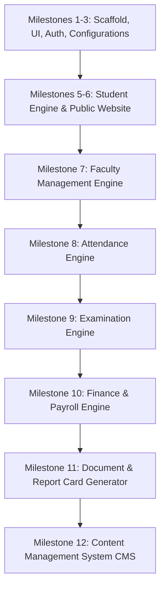

# PROJECT_VISION.md — Deukhuri Digital Campus ERP

## 🌟 Mission

The mission of the **Deukhuri Digital Campus School ERP** is to provide educational institutions in suburban and rural communities with an enterprise-grade, highly reliable, and modern administrative resource planning system. This ERP minimizes manual administration, ensures audit integrity, and streamlines workflows for school administrators, teachers, parents, and students.

---

## 🎯 Target Users

1. **Super Administrators**: Oversee database records, manage roles and configurations across the platform, and bypass granular checks when performing system maintenance.
2. **School Administrators / Registrar**: Manage student admissions, promote students, register faculty records, configure grading structures, and oversee daily campus configuration.
3. **Faculty / Teachers**: Access rosters, manage classroom assignments, mark student attendance, record marks, and request leaves.
4. **Students & Guardians**: Securely access academic progress reports, view fee statements, follow class announcements, and manage basic profile details.
5. **Anonymous Public Users**: Browse the public school marketing site, read recent announcement boards, view fees tables, and explore faculty profiles.

---

## 🏗️ Architecture Philosophy

1. **Engine-Based Decoupling**: Features are built as isolated vertical slices ("Engines"). They own their database schemas, business rules, routing, and UI views.
2. **Strict Layered Boundary**: Under `backend/src/`, every engine adheres to a unidirectional data flow:
   ```
   HTTP Client ➔ Express Route ➔ Controller ➔ Validator (Zod) ➔ Service ➔ Repository ➔ Prisma/DB
   ```
   No database access bypasses the repository layer, making data layers testable and interchangeable.
3. **Composition Over Inheritance**: Cross-engine dependency is modeled strictly via composition at the Repository/Service boundary. Direct database cross-table writes are prohibited.
4. **Hard-Delete Safety**: Standard reference data is archived (`RecordStatus: ACTIVE | ARCHIVED`). Entity deletions are blocked if downstream relationships exist, preventing database constraint failures or orphaned records.

---

## 🗺️ Long-Term Roadmap



* **Completed Milestones (v0.1.0 - v0.7.0)**:
  * Project initialization, core UI kit, dynamic theme engines.
  * Robust JWT credential auth, password-reset flow, and token queue handlers.
  * System calendars (Academic Year, Terms), Grading Scales, and School Profile config.
  * Student Admissions transaction-backed system and student registry with CSV export features.
  * Faculty Directory with designations, emergency contacts, qualifications ledger, and salary permission checks.
* **Phase 2 (Upcoming)**:
  * **Attendance Engine (Milestone 8)**: Attendance markers for student and staff sections, plus full leave request and approval loops.
  * **Examination Engine (Milestone 9)**: Date scheduler, grading worksheets, and academic transcript calculations.
* **Phase 3**:
  * **Finance Engine (Milestone 10)**: Dynamic fee structures, collections, salary pay structures, and payment audits.
  * **Document Engine (Milestone 11)**: Scanned attachment management and automated PDF report-card creator.
  * **CMS Engine (Milestone 12)**: Administrative portal backing the school website notices, news feed, and bios.

---

## 🚀 SaaS Transition Vision

While initially developed as a localized school management tool, the long-term design anticipates transition to a multi-tenant SaaS provider:
* **Tenant Isolation**: Every database model contains a scoping reference (e.g. `schoolId`).
* **Scoped Subdomains**: Subdomain router matches client requests to designated database tenants.
* **Dynamic Customization**: System configurations (e.g., logo branding, leadership boards) allow distinct visual skins per tenant.

---

## 🛑 Non-Goals

* **General LMS Features**: This project does not aim to replace specialized learning platforms like Canvas or Moodle (no homework submissions, online testing, or custom discussion forums).
* **Payment Gateways Core Code**: Financial structures will handle transaction logs but integrate third-party gateways (e.g., Khalti, eSewa, Stripe) via hooks rather than building raw credit card processors.
* **Standalone Mail Servers**: We consume existing SMTP/transactional APIs instead of maintaining standalone mail/SMS relays.
