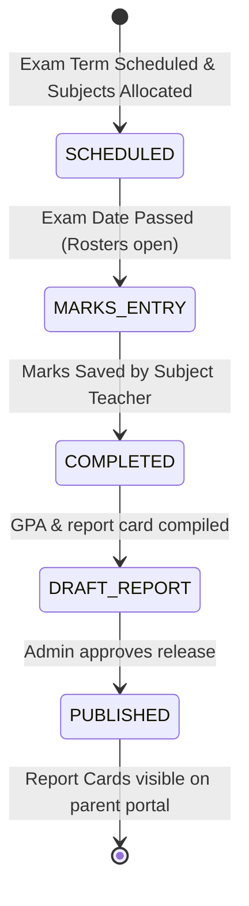

# Examination Engine — Design Specification (Pre-Implementation)

**Status:** 🚧 Draft — Sprint 8.0 Design Phase (Awaiting Review and Sign-off)

---

## 1. Business Analysis

### Why this engine, why now
The **Examination Engine** is the core academic evaluator of the ERP. Having built Student rosters, Teacher assignments, and daily Attendance registries, the platform must now track student grades and academic performance. 

This engine is responsible for defining exam schedules, providing mark ledgers for teachers to record theory/practical scores, calculating GPA and grade letters, compiling term-wise results, and generating printable Report Cards.

### Core Domain Scope
1. **Examination Terms**: Mapped to academic years (e.g., First Terminal Exam, Mid-Term Exam, Final Terminal Exam).
2. **Dynamic Marks Model (Theory vs. Practical)**: Support subjects with independent theory and practical (or internal) assessments (e.g., Science: 75 max theory, 25 max practical). Enforces individual pass boundaries (e.g., 35% on theory and 35% on practical).
3. **Marks Ledger**: Grid sheets for teachers to record students' scores.
4. **Grading Configurations**: Sourced from System Configuration's `GradingScale` (mapping percentage ranges to letter grades like `A+`, `A`, `B+` and Grade Points like `4.0`, `3.6`).
5. **Result Publication Workflow**: Safe lifecycle state switches governing report card visibility.
6. **Report Card PDF Generation**: Printable landscape or portrait templates containing term grades, teacher remarks, attendance summaries, and principal signatures.

### Out of Scope (Deferred to future sprints)
* **Re-evaluations / Re-totaling workflows** — manual adjustment by Admins will be used initially.
* **Admit Card Printing** — scheduled for later document generation releases.
* **Exam Hall allocation algorithms** — manual room assignment only.

---

## 2. Database Design

### New Enums
```prisma
enum ExamStatus {
  SCHEDULED
  COMPLETED
  CANCELLED
}

enum MarksEntryStatus {
  PRESENT
  ABSENT
  DISQUALIFIED
}

enum ExamResultStatus {
  DRAFT
  PUBLISHED
}
```

### Proposed Prisma Models
We will append the following models to `backend/prisma/schema.prisma`:

```prisma
// Represents a terminal examination cycle (e.g. First Term, Mid Term, Finals)
model ExamTerm {
  id             String         @id @default(uuid())
  name           String         // e.g. First Terminal Examination
  academicYearId String
  academicYear   AcademicYear   @relation(fields: [academicYearId], references: [id])
  startDate      DateTime
  endDate        DateTime
  status         ExamResultStatus @default(DRAFT) // Controls overall report card publication
  exams          Exam[]
  reportCards    ExamReportCard[]
  createdAt      DateTime       @default(now())
  updatedAt      DateTime       @updatedAt

  @@unique([academicYearId, name])
  @@map("exam_terms")
}

// Represents a scheduled exam subject instance (e.g. Class 6 Science Exam inside First Term)
model Exam {
  id               String         @id @default(uuid())
  examTermId       String
  examTerm         ExamTerm       @relation(fields: [examTermId], references: [id])
  classSubjectId   String
  classSubject     ClassSubject   @relation(fields: [classSubjectId], references: [id])
  
  examDate         DateTime       // Midnight UTC
  startTime        String         // e.g. "09:00"
  endTime          String         // e.g. "12:00"
  roomNumber       String?

  // Marks Limits Configurations
  theoryMaxMarks      Float
  theoryPassMarks     Float
  practicalMaxMarks   Float       @default(0) // 0 implies no practical component
  practicalPassMarks  Float       @default(0)

  status           ExamStatus     @default(SCHEDULED)
  marks            ExamMark[]
  createdAt        DateTime       @default(now())
  updatedAt        DateTime       @updatedAt

  @@unique([examTermId, classSubjectId])
  @@map("exams")
}

// Stores marks obtained by an enrolled student for a specific exam
model ExamMark {
  id                String           @id @default(uuid())
  examId            String
  exam              Exam             @relation(fields: [examId], references: [id])
  studentId         String
  student           Student          @relation(fields: [studentId], references: [id])
  
  status            MarksEntryStatus @default(PRESENT)
  theoryObtained    Float?           // Nullable to represent not entered yet
  practicalObtained Float?           // Nullable to represent not entered yet
  remarks           String?
  
  enteredById       String
  enteredBy         User             @relation(fields: [enteredById], references: [id])
  createdAt         DateTime         @default(now())
  updatedAt         DateTime         @updatedAt

  @@unique([examId, studentId])
  @@map("exam_marks")
}

// Pre-compiled term results for fast parent portal reads and printing
model ExamReportCard {
  id             String         @id @default(uuid())
  examTermId     String
  examTerm       ExamTerm       @relation(fields: [examTermId], references: [id])
  studentId      String
  student        Student        @relation(fields: [studentId], references: [id])
  
  // Compiled Ratios
  totalMarksObtained Float
  gpa                Float
  attendanceRate     Float?
  remarks            String?
  
  createdAt      DateTime       @default(now())
  updatedAt      DateTime       @updatedAt

  @@unique([examTermId, studentId])
  @@map("exam_report_cards")
}
```

---

## 3. Exam Lifecycle & Publication Workflow



### Key Workflow Rules:
1. **Validations during entry**: Teachers cannot input scores exceeding `theoryMaxMarks` or `practicalMaxMarks`.
2. **Locking rules**: Once the Admin sets the `ExamTerm` status to `PUBLISHED`, marks entries are permanently frozen. Any edits require an explicit rollback to `DRAFT` by a Super Admin.

---

## 4. Permissions Matrix

The following permissions will be seeded in `prisma/seed.ts`:

| Permission Code | Description | Role Assignments |
| :--- | :--- | :--- |
| `exams.manage` | Create terms, schedule exams, set marks parameters. | Admin, Super Admin |
| `exams.enter` | Input obtained scores in the subject marks ledger. | Admin, Teacher |
| `exams.publish` | Toggle term results publication state. | Admin, Super Admin |
| `exams.view` | View personal grades and download report cards. | Student, Parent, Teacher |

---

## 5. API Contracts

### Endpoints (REST API)

* **Exam Terms Management**:
  * `POST /api/v1/exams/terms` - Create term.
  * `GET /api/v1/exams/terms` - List terms.
* **Exam Instances Schedules**:
  * `POST /api/v1/exams` - Schedule an exam (body: term, subject, date, timings, marks constraints).
  * `GET /api/v1/exams` - Query scheduled list (filters: term, class).
* **Marks Ledger Entries**:
  * `GET /api/v1/exams/:id/ledger` - Fetch students list and current marks entries.
  * `POST /api/v1/exams/:id/ledger` - Bulk upsert marks records (body: studentId, status, theoryObtained, practicalObtained, remarks).
* **Report Cards & Publications**:
  * `POST /api/v1/exams/terms/:id/publish` - Toggle publication state.
  * `GET /api/v1/exams/terms/:id/report-cards/:studentId` - Fetch compiled report card details.
  * `GET /api/v1/exams/terms/:id/report-cards/:studentId/print` - Streams printable report card PDF.

---

## 6. UI/UX Wireframe Specifications

### 🖥️ Marks Entry Ledger Screen
Designed to facilitate high-speed grid data entry:
* A tabular grid matching spreadsheet workflows.
* Keyboard navigation support: `Arrow Up`/`Down` shifts inputs, `Tab` jumps columns.
* Fast save shortcuts: Ctrl+S saves drafts.

```
+--------------------------------------------------------------------------------+
| Class 6 - Mathematics | Final Term Exam (Max Th: 75 | Max Pr: 25)              |
+--------------------------------------------------------------------------------+
| Roll | Name          | Status    | Theory Mark (75) | Practical (25) | Remarks |
+------+---------------+-----------+------------------+----------------+---------+
| 01   | Alok Bhusal   | [Present] | [ 68.0         ] | [ 22.0       ] | Good    |
| 02   | Sunita Oli    | [Present] | [ 45.0         ] | [ 18.0       ] | -       |
| 03   | Ramesh Thapa  | [Absent]  | [ -            ] | [ -          ] | Excused |
+------+---------------+-----------+------------------+----------------+---------+
```

### 📄 Report Card Template Design
Standardized landscape layout:
* **Header**: School name, emblem, student information (name, class, roll, admission number).
* **Grade Table**:
  * Columns: Subject, Theory Score, Practical Score, Total Score, Letter Grade, Subject Grade Point (GP).
* **GPA Aggregates Box**: Total Obtained Marks, Cumulative Grade Point Average (GPA), Final Term Grade.
* **Legend Box**: Grading Scale matrix guide.
* **Signatures**: Subject Teacher remarks, Class Teacher signature, Principal seal space.

---

## 7. Definition of Done (DoD)

1. **Database Schema**: prisma migrations run successfully, seed file updated with exam permissions.
2. **Layering**: Clean separation: `Controller` parses query ➔ `Service` manages GPA math & database transactions ➔ `Repository` handles bulk database ops.
3. **GPA Rules Integrity**: Enforces strict calculations following CDC Nepal grading guidelines.
4. **PDF Engine**: Server-side PDF engine (e.g., pdfkit or puppeteer) streams clean PDF templates.
5. **Typescript & Lint**: 100% build pass.
6. **Automated Testing**: Integration test suite verifying ledger inputs, validations checks, and report card GPAs.
