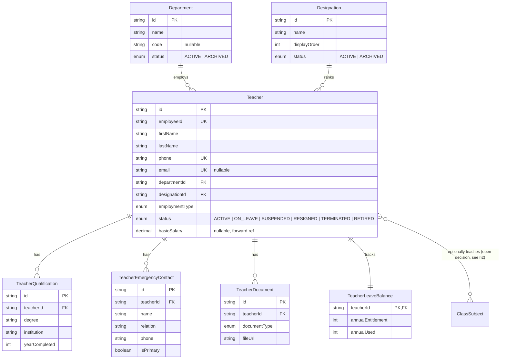
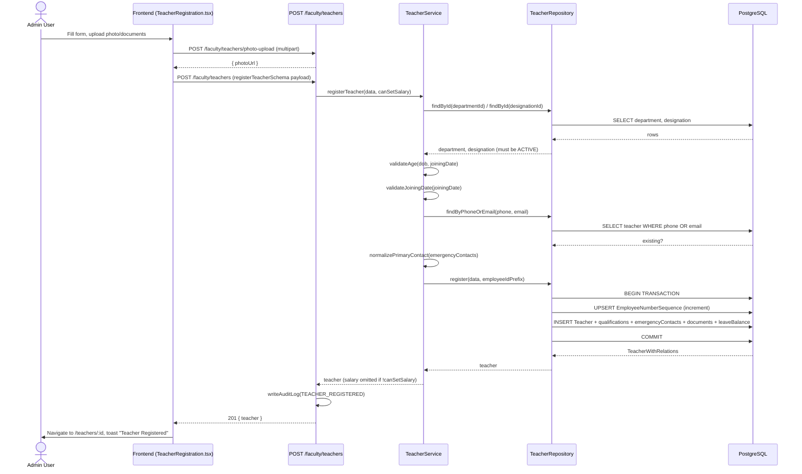

# Faculty Management Engine — Design Specification (Pre-Implementation)

**Status:** 🚧 Reopened for v2 — Sprint 6.1 (seed data) shipped on top of a Complete v1. See §10 for the v1 post-implementation audit, §11 for the workflow sequence diagram, and **§12 for the v2 gap analysis awaiting sign-off** before Attendance (v0.7.0) starts.

**Approved decisions:**
1. **ClassSubject.teacherId** — approved. Add as a nullable, additive FK on the existing `ClassSubject` model.
2. **`teachers.delete` → `teachers.archive`** — approved. Renamed in `seed.ts`.
3. **Terminal status reversibility** — approved. `RESIGNED|TERMINATED|RETIRED → ACTIVE` is an allowed transition (rehire case).
4. **Emergency contacts** — approved as a child table (`TeacherEmergencyContact`, multiple rows, one `isPrimary`).

This is Engine 6 in the [ADR-005 engine table](./ADR-005-engine-based-architecture.md#engines-as-of-2026-07-08) (listed there as "Planned" implicitly under future HR scope) and the next engine to build per the agreed build order, ahead of Attendance, Examination, and Finance.

---

## 1. Business Analysis

**Why this engine, why now.** Every downstream engine that references "who teaches" — Attendance (teacher-marked registers), Examination (marks entry by subject teacher), Finance (payroll) — needs a real Teacher record to point at. Right now `ClassSubject` has no owner; a school configuring "Grade 6 Mathematics" today cannot say who teaches it. Faculty Management is reference data the same way the Academic Engine is: other engines will hold `teacherId` foreign keys into it, never redefine "teacher" themselves.

**What this engine owns:** the teacher directory (HR profile, employment status, department/designation, qualifications, emergency contacts, documents) and a simple leave-balance ledger.

**What this engine explicitly does NOT own** (deferred to a later engine, so scope doesn't quietly balloon):
- **Leave requests/approval workflow** — Engine 2 (Attendance) owns "Leave" as a workflow (request → approve/reject → attendance impact). This engine only tracks the resulting **balance** (entitlement minus used), since Attendance needs somewhere to decrement when a leave is approved.
- **Payroll / payslips** — Engine 5 (Finance) owns salary processing. This engine holds a `basicSalary` reference field only (same forward-reference pattern as `Student.feeCategory`), gated behind a dedicated permission.
- **Timetabling** ("Teacher X teaches Section A Math on Monday period 3") — no engine owns this yet; out of scope here.

---

## 2. Database Design

### New enums
```prisma
enum EmploymentType {
  FULL_TIME
  PART_TIME
  CONTRACT
  VISITING
}

// Lifecycle status — distinct from RecordStatus for the same reason
// StudentStatus is distinct from it: *why* someone left matters for records.
enum TeacherStatus {
  ACTIVE
  ON_LEAVE
  SUSPENDED
  RESIGNED
  TERMINATED
  RETIRED
}

enum TeacherDocumentType {
  CITIZENSHIP
  ACADEMIC_CERTIFICATE
  EXPERIENCE_LETTER
  APPOINTMENT_LETTER
  PAN_CARD
  PHOTO
  OTHER
}
```
`Gender` is reused from the Student Admission Engine (already generic, not student-specific).

### New models
```prisma
// Reference data — mirrors Subject's shape (name/code/status), owned here.
model Department {
  id          String        @id @default(uuid())
  name        String        @unique
  code        String?       @unique
  description String?
  status      RecordStatus  @default(ACTIVE)
  teachers    Teacher[]
  createdAt   DateTime      @default(now())
  updatedAt   DateTime      @updatedAt

  @@map("departments")
}

// Reference data — small ordered list (Principal, Vice Principal, HOD, Senior
// Teacher, Teacher, Assistant Teacher, ...). displayOrder drives hierarchy
// sort in the UI, the same role GradingScale.order and Class.displayOrder play.
model Designation {
  id           String       @id @default(uuid())
  name         String       @unique
  displayOrder Int
  description  String?
  status       RecordStatus @default(ACTIVE)
  teachers     Teacher[]
  createdAt    DateTime     @default(now())
  updatedAt    DateTime     @updatedAt

  @@map("designations")
}

// Faculty Management Engine — Teacher is reference data other engines (Attendance,
// Examination, Finance) will hold teacherId FKs into, the same way Class/Section
// are owned by the Academic Engine. Not a bare CRUD entity: registration runs
// through a workflow that generates an employeeId, same shape as admission.
model Teacher {
  id         String   @id @default(uuid())
  employeeId String   @unique

  firstName  String
  middleName String?
  lastName   String

  dateOfBirth DateTime
  gender      Gender
  photoUrl    String?
  bloodGroup  String?

  phone String  @unique
  email String? @unique

  address      String?
  province     String?
  district     String?
  municipality String?
  ward         String?

  departmentId   String
  department     Department     @relation(fields: [departmentId], references: [id])
  designationId  String
  designation    Designation    @relation(fields: [designationId], references: [id])
  employmentType EmploymentType
  joiningDate    DateTime
  leavingDate    DateTime?
  status         TeacherStatus  @default(ACTIVE)

  // Forward reference — no Finance/Payroll Engine yet; same pattern as
  // Student.feeCategory. Read/write gated behind teachers.salary, not
  // teachers.read/update, since compensation is more sensitive than a profile edit.
  basicSalary Decimal? @db.Decimal(10, 2)

  qualifications    TeacherQualification[]
  emergencyContacts TeacherEmergencyContact[]
  documents         TeacherDocument[]
  leaveBalance      TeacherLeaveBalance?

  createdAt DateTime @default(now())
  updatedAt DateTime @updatedAt

  @@map("teachers")
}

model TeacherQualification {
  id            String   @id @default(uuid())
  teacherId     String
  teacher       Teacher  @relation(fields: [teacherId], references: [id], onDelete: Cascade)
  degree        String
  fieldOfStudy  String?
  institution   String
  yearCompleted Int
  createdAt     DateTime @default(now())

  @@map("teacher_qualifications")
}

// A teacher can list more than one contact (spouse + parent, etc.), unlike
// Student's fixed Father/Mother/Guardian relations — isPrimary (service-layer
// enforced: exactly one per teacher) marks which one gets called first.
model TeacherEmergencyContact {
  id        String   @id @default(uuid())
  teacherId String
  teacher   Teacher  @relation(fields: [teacherId], references: [id], onDelete: Cascade)
  name      String
  relation  String
  phone     String
  isPrimary Boolean  @default(false)
  createdAt DateTime @default(now())

  @@map("teacher_emergency_contacts")
}

model TeacherDocument {
  id           String              @id @default(uuid())
  teacherId    String
  teacher      Teacher             @relation(fields: [teacherId], references: [id], onDelete: Cascade)
  documentType TeacherDocumentType
  fileUrl      String
  uploadedAt   DateTime            @default(now())

  @@map("teacher_documents")
}

// Balance ledger only — no request/approval workflow here (see §1). Attendance
// Engine decrements *Used fields when it approves a leave; this engine just
// exposes and lets HR adjust entitlements.
model TeacherLeaveBalance {
  teacherId          String   @id
  teacher            Teacher  @relation(fields: [teacherId], references: [id], onDelete: Cascade)
  annualEntitlement  Int      @default(18)
  sickEntitlement    Int      @default(12)
  casualEntitlement  Int      @default(6)
  annualUsed         Int      @default(0)
  sickUsed           Int      @default(0)
  casualUsed         Int      @default(0)
  updatedAt          DateTime @updatedAt

  @@map("teacher_leave_balances")
}

// Global counter (not per-year like AdmissionNumberSequence) — staff persist
// across academic years, so employeeId doesn't reset annually.
model EmployeeNumberSequence {
  id         String @id @default("singleton")
  lastNumber Int    @default(0)

  @@map("employee_number_sequences")
}
```

### `AuditAction` additions
```prisma
TEACHER_REGISTERED
TEACHER_UPDATED
TEACHER_STATUS_CHANGED
TEACHER_ARCHIVED
```

### ✅ Resolved — this engine touches `ClassSubject`
Approved: an **optional, additive** `teacherId String?` FK on the existing `ClassSubject` model (Academic Engine). This is:
- **Backward compatible** — nullable, no existing rows or behavior break.
- **A deliberate, minimal exception** to "don't redesign shipped engines," not a redesign — the Academic Engine's repository/service gain one optional field and an `assignTeacher` method, nothing else changes.

---

## 3. ER Diagram



---

## 4. Workflow

**Registration** (`POST /teachers`) — analogous to `POST /students/admission`:
1. Validate `departmentId`/`designationId` exist and are `ACTIVE` (same cross-engine-repository-composition pattern as Student → Academic Engine).
2. Generate `employeeId` via `EmployeeNumberSequence` inside the same transaction (prevents collision under concurrent registrations, same as admission numbers).
3. Create `Teacher` + optional `TeacherQualification[]` + optional `TeacherEmergencyContact[]` + a zero-balance `TeacherLeaveBalance` row, in one transaction.
4. Write `TEACHER_REGISTERED` audit log.

**Status lifecycle** (`POST /teachers/:id/status`): `ACTIVE → ON_LEAVE → ACTIVE` (reversible), `ACTIVE → SUSPENDED → ACTIVE` (reversible), `ACTIVE → RESIGNED | TERMINATED | RETIRED` (terminal — sets `leavingDate`, blocks further status changes except by a Super Admin correcting a mistake, same as Student's status endpoint has no such extra guard today — **flagging this as an inconsistency worth fixing here rather than copying it forward** — see Edge Cases).

**Leave balance adjustment** (`PATCH /teachers/:id/leave-balance`) — HR-only manual entitlement correction (e.g. year-start reset, carried-over days). Not the leave *request* flow.

---

## 5. Permissions Matrix

| Code | Grants | Notes |
| :--- | :--- | :--- |
| `teachers.read` | View directory, profiles, departments, designations | *(already seeded)* |
| `teachers.create` | Register new teachers, create Departments/Designations | *(already seeded)* |
| `teachers.update` | Edit profile, qualifications, emergency contacts, status (non-terminal) | *(already seeded)* |
| `teachers.archive` | Archive Department/Designation, set terminal status (resigned/terminated/retired) | **Renamed from the already-seeded `teachers.delete`** — aligns with the `academic.archive`/`students.archive` convention adopted after `teachers.delete` was originally seeded as a placeholder. Safe to rename: `seed.ts` fully flushes and re-seeds permissions on every run, so no production role-permission row references the old code yet. |
| `teachers.salary` | View/edit `basicSalary` | Separate from `teachers.update` — compensation is more sensitive than a profile edit; lets a school grant profile-edit rights to office staff without exposing pay. |
| `teachers.leave` | View/adjust leave balances | Separate from `teachers.update` for the same reason — HR-only in most schools. |
| `teachers.documents` | Upload/view/delete HR documents (citizenship, contracts) | Separate from `teachers.update` — identity documents warrant tighter access than a phone-number edit. |

**Admin role** gets all seven (mirrors how the Admin role already gets the full `students.*`/`academic.*` sets). **Super Admin** continues to bypass via `*`.

---

## 6. API Contract

All routes under `/api/v1/teachers`, `requireAuth` + the permission noted.

| Method | Path | Permission | Purpose |
| :--- | :--- | :--- | :--- |
| POST | `/photo-upload` | `teachers.create` | Upload profile photo (plumbing only, mirrors `/students/photo-upload`) |
| POST | `/document-upload` | `teachers.documents` | Upload a document file, returns URL |
| POST | `/` | `teachers.create` | Register a new teacher (workflow, §4) |
| GET | `/` | `teachers.read` | List/search/filter/paginate |
| GET | `/summary` | `teachers.read` | Dashboard stat tiles: total, active, onLeave, byDepartment counts |
| GET | `/:id` | `teachers.read` | Full profile with relations |
| PUT | `/:id` | `teachers.update` | Update profile fields |
| POST | `/:id/status` | `teachers.update` *(non-terminal)* / `teachers.archive` *(terminal)* | Status transition — service layer picks the required permission by target status |
| DELETE | `/:id` | `teachers.archive` | Hard-delete, only if zero `ClassSubject` references (if §2's FK is approved) |
| POST | `/:id/qualifications` | `teachers.update` | Add a qualification |
| DELETE | `/:id/qualifications/:qualId` | `teachers.update` | Remove a qualification |
| POST | `/:id/emergency-contacts` | `teachers.update` | Add a contact |
| PUT | `/:id/emergency-contacts/:contactId` | `teachers.update` | Edit a contact |
| DELETE | `/:id/emergency-contacts/:contactId` | `teachers.update` | Remove a contact |
| POST | `/:id/documents` | `teachers.documents` | Attach an uploaded document |
| DELETE | `/:id/documents/:docId` | `teachers.documents` | Remove a document |
| GET | `/:id/leave-balance` | `teachers.leave` | View balance |
| PATCH | `/:id/leave-balance` | `teachers.leave` | Adjust entitlement |
| GET | `/export` | `teachers.read` | CSV export (paginated fetch, client-side generation — same pattern as Students registry) |
| — Departments — | `/departments` (GET/POST/PUT, archive via `PATCH /departments/:id/status`) | `teachers.read`/`create`/`update`/`archive` | Reference-data CRUD, same shape as Academic Engine's Subject |
| — Designations — | `/designations` (GET/POST/PUT, archive via `PATCH /designations/:id/status`) | `teachers.read`/`create`/`update`/`archive` | Reference-data CRUD, same shape as Academic Engine's Subject |

---

## 7. Validation Rules (Zod, mirrors `student.validator.ts` conventions)

- `phone`: required, unique — checked at service layer (friendly 409, not a raw Prisma constraint error), same treatment as `Enrollment`'s roll-number uniqueness.
- `email`: optional, but if present must be unique.
- `dateOfBirth`: must result in age ≥ 18 at `joiningDate` (business rule, service-layer — not enforceable by Zod alone since it's cross-field).
- `joiningDate`: cannot be in the future.
- `leavingDate`: required when status becomes `RESIGNED | TERMINATED | RETIRED`, forbidden otherwise.
- `qualifications[].yearCompleted`: between 1950 and current year.
- `emergencyContacts`: at least one required at registration (mirrors Student's "at least one guardian" rule); exactly one may have `isPrimary: true` (service-layer, same fixed-cardinality pattern as `StudentGuardian`, enforced differently since relation isn't fixed-enum here).
- `basicSalary`: only accepted in the request body if the caller holds `teachers.salary` — silently stripped otherwise, not a validation error (avoids leaking which fields exist to unauthorized roles via error messages).

---

## 8. Edge Cases

1. **Rehiring a former teacher** (status was `RESIGNED`/`TERMINATED`/`RETIRED`, they return) — approved: the same `POST /:id/status` endpoint allows `RESIGNED|TERMINATED|RETIRED → ACTIVE` (clears `leavingDate`). This intentionally reverses Student's stricter "terminal is terminal" model, since staff turnover/rehire is common and this engine has no `Enrollment`-style history table that reopening the record would corrupt. The existing `phone`/`email` unique constraints are exactly why reactivating the same record (rather than forcing a new one with a new `employeeId`) is the right call — it avoids a duplicate-person record for the same human.
2. **Deleting a Department/Designation with active teachers** — blocked (404-style guard already established for `academic.archive`'s "archive-only while referenced" rule) until every `Teacher` referencing it is reassigned or archived.
3. **Concurrent registration** — same `P2002` → `409` translation pattern as Student admission's roll-number race.
4. **`teachers.salary` permission removed from a role after data exists** — reads must omit `basicSalary` from the response entirely (not `null`-mask it), so its absence doesn't look like "no salary set."
5. **A teacher with zero `ClassSubject` assignments** — valid; not every registered teacher is necessarily assigned yet (e.g. newly joined, or an administrative-only Designation like Librarian if that's modeled as a Designation rather than a separate role).

---

## 9. Acceptance Criteria / Definition of Done

- [x] Schema reviewed and migrated; `EmployeeNumberSequence` generates collision-free IDs under concurrent load (transaction-tested — verified in the §10 audit).
- [x] Controllers contain zero direct Prisma imports (grep-checked, matching the existing convention).
- [x] All 7 permissions seeded; `teachers.delete` fully renamed to `teachers.archive` (seed + any doc references).
- [x] Every HR-record-level mutation writes an audit log entry — extended in the §10 audit to also cover Department/Designation CRUD and leave-balance adjustments (`AuditAction` grew from 4 to 13 values). Sub-resource add/remove (qualifications, emergency contacts, documents) is a deliberate exception — see [docs/api/faculty.md § Audit logging](../api/faculty.md#audit-logging).
- [x] CSV export matches the Students registry's client-side pattern.
- [x] Zod validators cover every rule in §7.
- [ ] Unit tests for the cross-field validators (age check, terminal-status leavingDate requirement) — **not written**. No engine in this repo has unit test coverage yet; there is no `test` script in either `package.json` and no test files anywhere in the codebase. This is a platform-level gap (see the project's Track C / Repository Health backlog), not something introduced or specific to this engine — flagged here rather than silently checked off.
- [x] `docs/api/faculty.md` written (per-endpoint request/response contract, mirroring `docs/api/students.md`).
- [x] `docs/architecture/faculty-engine-er-diagram.md` finalized (promoted from this spec's §3 once schema is locked).
- [x] ADR-005's engine table updated to mark Faculty Management `✅ Done`.
- [x] `CHANGELOG.md` entry with Release Statistics (endpoints/models/permissions added).
- [ ] `README.md` Milestone 6 status flipped to `✅ Complete` — stays `🚧 Unreleased (v0.7.0)` until the version is actually tagged, matching how Milestone 7 (Student Management) is handled; flip both together at tag time.
- [x] `npx tsc --noEmit`, `npm run lint`, `npm run build` all clean on both `frontend`/`backend` — the `tsc -b` failure was a pre-existing, repository-wide zod v4/`@hookform/resolvers` v5 typing issue (see CHANGELOG), fixed with one architectural pattern rather than patched per file.
- [x] Frontend feature folder (`frontend/src/features/faculty/`) — Dashboard, Teachers registry, Registration, Detail (5 tabs), Departments, Designations. Routed and wired into the sidebar nav.

---

## 10. Post-Implementation Audit (Sprint 6.1)

Before moving to the Attendance Engine, a full gap analysis was run against this spec's own DoD — backend (endpoint coverage, validation, permissions, audit logging, layering, pagination, archive-vs-delete, uploads, transactions, error handling) and frontend (DTO parity, loading/empty/error states, toasts, permission gating, responsive layout, dark mode/accessibility, routing, and the full create→edit→upload→archive→restore→delete workflow traced through the code).

**Findings and fixes:**
1. `deleteQualification`/`deleteDocument` deleted by ID with no check that the row belonged to the given teacher — a wrong-teacher or nonexistent ID fell through to an unhandled Prisma `P2025` and leaked as a generic 500. Fixed with the same ownership check `deleteEmergencyContact` already had.
2. Department/Designation CRUD and leave-balance adjustments wrote no audit log, despite this spec's own DoD saying every mutating endpoint should. `AuditAction` extended (13 total); both controllers now call `writeAuditLog`.
3. The status dropdown in `TeacherDetail` listed all six statuses regardless of permission — a `teachers.update`-only user could select a terminal status and get a bare 403. Now filtered client-side to match the backend's actual permission split.
4. `Departments`/`Designations` pages had no permission checks on their action buttons at all (gated only by the page-level `teachers.read`), diverging from the documented per-action matrix. Added `teachers.create`/`update`/`archive` checks.
5. `npm run build`'s `tsc -b` step was failing — traced to a repository-wide zod v4 + `@hookform/resolvers` v5 incompatibility (not something this engine introduced; `StudentAdmission.tsx`, `ClassesAndSections.tsx`, `ClassSubjects.tsx`, and `SchoolProfile.tsx` were already broken on `develop`). Fixed with one pattern applied everywhere `z.coerce` appears in a form schema, rather than a per-file patch — see the CHANGELOG entry for the mechanism.

Everything else audited **PASS** — see the two audit transcripts run during this sprint for full file:line evidence (endpoint coverage, transaction safety on `employeeId` generation, Cloudinary upload limits, archive-vs-delete guards, DTO parity, and the full mutation-cache-invalidation trace through every hook).

---

## 11. Registration Workflow — Sequence Diagram



---

## 12. Post-Seeding Gap Analysis (v2) — Awaiting Sign-Off

Triggered 2026-07-09: after Sprint 6.1 (seed data) shipped, a broader HR feature checklist was proposed before tagging Faculty complete and starting Attendance. Two scope decisions were made up front (see project memory):
- **No Teacher→Staff/HRM generalization.** This engine stays scoped to teaching staff (`Teacher`), not a generic Staff entity for drivers/librarians/accountants/etc. Rejected to avoid an FK-ripple risk into Attendance/Payroll from a premature generalization.
- **Leave *workflow*** (apply/approve/reject) and **Payroll/Allowances** stay out of this engine — that was already decided in §1 and is *reconfirmed*, not reopened. They belong to the Attendance and Finance engines respectively, per the roadmap.

Every item below was checked against the actual code (backend + frontend), not assumed.

### Already Implemented
- Idempotent seed data: 5 departments, 6-tier designation ladder, demo teachers, collision-safe `EmployeeNumberSequence`.
- Full CRUD + workflow for Teacher/Department/Designation, audit logging on every mutation, granular permissions enforced both server-side (route middleware) and client-side (field/button gating) — see §10.
- Qualifications, Emergency Contacts, Documents, Leave Balance (ledger only) as sub-resources.
- Search/filter by name/employeeId/phone (combined free-text) + dedicated dropdowns for department/designation/status/employmentType.
- CSV export, matching the Students registry pattern exactly.
- Faculty Dashboard exists with 4 stat tiles (Total, Active, On Leave+Suspended, Joined This Month) + Recently Joined list (5) + Quick Actions.
- `ClassSubject.teacherId` FK already exists in the schema (added in v1) — the data model for subject/class/section assignment needs **no schema change**.

### Partially Implemented (schema/backend exists, no UI — or vice versa)
| Item | Gap |
| :--- | :--- |
| **Subject Assignment** | Backend `assignTeacher` endpoint exists on `ClassSubject` (from v1), but **no frontend surface calls it** — not on `ClassSubjects.tsx`, not on `TeacherDetail.tsx`. Pure frontend work, zero schema change. |
| **Dashboard richness** | Only 4 tiles + a joined-list exist. "By department" breakdown, "retiring soon," "upcoming birthdays" need new backend aggregation (`teacher.repository.ts` summary query) + frontend tiles. No schema change — `dateOfBirth`/`departmentId` already exist. |
| **Audit Timeline** | `writeAuditLog()` already fires on every mutation (register/update/status/archive/leave-adjust), but there is **no GET endpoint anywhere in the repo** (not just Faculty) to list audit rows back. This is a platform-level gap, not Faculty-specific — needs one generic audit-listing endpoint + a Teacher Detail tab that queries it filtered by teacher. |

### Genuinely Missing (real gaps within Faculty's own scope)
| Item | Notes |
| :--- | :--- |
| **Teaching Experience** (previous school, role, years, start/end) | No `TeacherExperience` model exists — distinct from `TeacherQualification` (degree/institution/year). Needs a new child table, same shape as `TeacherQualification`. |
| **Qualification detail depth** (certificate upload/verification flag) | Current model covers degree/field/institution/year; no certificate file link or a verified/unverified flag. |
| **Reports** (department headcount, gender/employment breakdown, experience-band export) | No dedicated reports endpoint; only the list `/summary` counts and ad-hoc CSV export exist today. |

### Explicitly Out of Scope for This Engine (belongs elsewhere, per roadmap — not reopened)
- **Leave workflow** (apply → approve → reject) — Attendance Engine (v0.7.0). This engine keeps owning the *balance* only.
- **Payroll / Allowances / Payslips** — Finance Engine. This engine keeps the `basicSalary` reference field only.
- **Weekly Timetable** (which periods a teacher teaches on which day) — no engine owns this yet; still explicitly out of scope per §1. Distinct from Subject Assignment above, which only says *who* teaches a `ClassSubject`, not *when*.
- **Teacher→Staff/HRM generalization** — rejected in this reopening (see decision above).

### Proposed v2 Definition of Done (for sign-off)
1. Subject Assignment UI wired into `ClassSubjects.tsx` and/or `TeacherDetail.tsx` (uses existing backend endpoint).
2. `TeacherExperience` model + CRUD sub-resource, mirroring `TeacherQualification`'s shape and permission gating.
3. Dashboard: add department breakdown, retiring-soon, and upcoming-birthdays tiles/lists.
4. Generic audit-log-listing endpoint (platform-level, reusable by Students/Notices/Gallery too) + a Teacher Detail "Activity" tab consuming it filtered by teacher.
5. A basic Faculty report (department headcount + gender/employment breakdown), exportable.
6. Qualification certificate upload + verified flag — **deferred unless explicitly requested**, lower priority than 1–5.

Awaiting explicit user sign-off on this list (and its priority order) before implementation begins, per [[feedback_design_before_implementation]].
