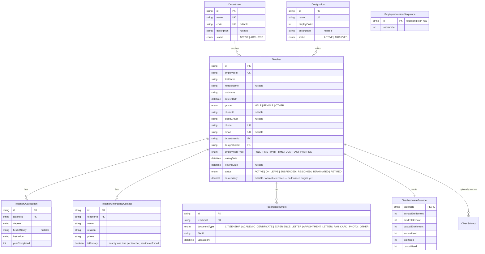

# Faculty Management Engine — ER Diagram

Reference data (`Department`, `Designation`) and workflow data (`Teacher` and its child records) owned exclusively by the Faculty Management Engine (`backend/src/modules/faculty/`). One deliberate, additive exception to strict ownership: `ClassSubject` (owned by the Academic Engine) holds a nullable `teacherId` FK into this engine — see [ADR-005](./ADR-005-engine-based-architecture.md) principle 7 and the [design spec](./faculty-engine-design-spec.md#-resolved--this-engine-touches-classsubject).

`EmployeeNumberSequence` has no FK to `Teacher` (unlike `AdmissionNumberSequence` → `AcademicYear`) — it's a single global counter, not scoped per academic year, since staff persist across years unlike students.

Not modeled here, and explicitly out of scope for this engine:
- **Leave requests/approval** — balance only; the workflow belongs to the future Attendance Engine.
- **Payroll/payslips** — `basicSalary` is a bare reference field; processing belongs to the future Finance Engine.
- **Timetabling** ("Teacher X teaches Section A on Monday period 3") — no engine owns this yet.
